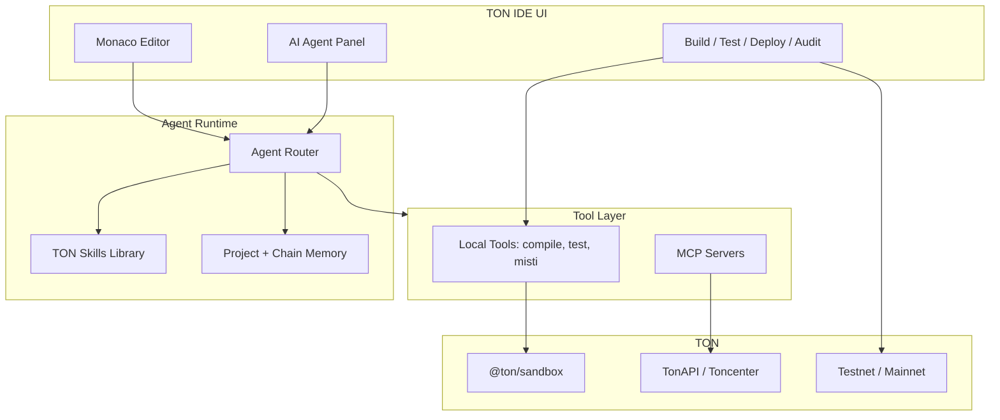

# TON IDE 2.0 — видение и архитектура

TON IDE 2.0 — специализированная среда разработки для экосистемы TON: «Cursor для блокчейна TON», где AI-агенты, инструменты и контекст заточены под смарт-контракты, dApp и on-chain продукты.

Текущая база — [TON Web IDE](https://ide.ton.org) (этот репозиторий): Monaco, WebContainer, FunC/Tact, sandbox, deploy, Misti, git, verifier.

## Цели 2.0

| Направление | Сейчас (1.x) | Цель (2.0) |
|-------------|--------------|------------|
| AI | Нет | Агенты с глубоким знанием TON, FunC, Tolk, Tact |
| Языки | FunC, Tact | + Tolk, Blueprint-first workflows |
| Шаблоны | Counter, blank | Jetton (TEP-74/89), NFT, AMM/DEX, staking, governance |
| Контекст | Файлы проекта | Проект + ABI + sandbox trace + on-chain state |
| Инструменты | Встроенные панели | Единый tool layer + MCP для внешних сервисов |
| Расширяемость | Монолит | Плагины, skills, MCP-серверы |

## Архитектура (высокий уровень)



## AI-агенты (роли)

1. **Contract Developer** — FunC, Tolk, Tact; opcodes, storage, messages, get-methods.
2. **Jetton Engineer** — TEP-74/89, minter/wallet, metadata, admin ops, custom fees.
3. **DeFi Architect** — AMM (constant product / stable), pools, LP, routing, oracle hooks.
4. **Frontend Integrator** — TonConnect, @ton/core, SDK для dApp.
5. **Security Auditor** — Misti, gas/storage, bounce/replay, access control.

Каждый агент использует общий **tool layer** и свой **skill** (system prompt + примеры + чеклисты).

## Tool Layer и MCP

Встроенные инструменты (уже в IDE или планируются):

- `compile_contract` — func-js / tact / tolk (когда добавим)
- `run_sandbox_tests` — Blueprint + @ton/sandbox
- `deploy_contract` — sandbox / testnet / mainnet
- `read_project_files` / `apply_patch` — работа с WebContainer FS
- `misti_analyze` — статический анализ Tact
- `verify_on_chain` — contract verifier
- `fetch_account_state` — баланс, код, данные по адресу

MCP-серверы (подключаемые, конфиг в IDE):

| Сервер | Назначение |
|--------|------------|
| `ton-api` | TonAPI / Toncenter: аккаунты, транзакции, jetton metadata |
| `ton-docs` | Поиск по docs.ton.org, TEP, cookbook |
| `blueprint` | Скaffold, deploy scripts, network config |
| `github-ton` | Шаблоны: jetton, dedust, ston-fi reference |
| `wallet` | TonConnect sign (с подтверждением пользователя) |

## Контекст для агентов

Агент получает структурированный контекст (не только сырой чат):

```json
{
  "project": { "language": "tact", "template": "jetton", "root": "/project" },
  "openFiles": ["contracts/jetton.tact"],
  "build": { "lastCompile": "ok", "bocHash": "..." },
  "sandbox": { "lastTestRun": "3 passed" },
  "chain": { "network": "testnet", "contractAddress": "EQ..." },
  "abi": { "...": "..." }
}
```

## Шаблоны продуктов (roadmap)

- **Jetton** — master + wallet, mint/burn/transfer, custom payload
- **AMM DEX** — pool, router, LP jetton, swap quotes (reference: DeDust / STON patterns)
- **NFT** — TEP-62 collection + item
- **Staking / vesting** — timelocks, claims
- **Governance** — voting jetton, proposals

## Этапы внедрения

### Фаза 0 — Foundation

- Документация 2.0
- UI-панель агента (shell)
- Типы, конфиг агентов и MCP
- Skills в `src/features/agent/skills/`

### Фаза 1 — Agent MVP (реализовано)

- `server/agent-api` — chat + mock/OpenAI, MCP ton-api/docs
- `src/services/*` — compile, test, FS, misti, deploy stub
- Tool registry + Agent Panel с tool loop и patch approve
- Webpack/nginx proxy `/api/agent`

### Фаза 2 — TON-native depth (реализовано)

- Tolk: language id, подсветка, compile stub
- Шаблоны `tonJetton`, `tonAmm` (Tact)
- MCP handlers в agent-api

### Фаза 3 — Ecosystem (MVP реализовано)

- `ton-ide-plugin.json` loader + Settings UI
- Cloud jobs API + панель в Agent
- `.ide/shared-context.json` + share URL `?share=`

## Технические решения

- **Frontend**: остаётся React + Monaco + WebContainer (быстрый старт в браузере).
- **Agents**: Vercel AI SDK или AI Gateway — streaming, structured tools, provider routing.
- **Desktop (опционально)**: Electron/Tauri + локальный MCP — для power users.
- **Безопасность**: все on-chain действия только через TonConnect с явным approve; API keys только в env, не в репозитории.

## Связанные документы

- [Agent System](./AGENT_SYSTEM.md) — роли, tools, skills format
- [README](../README.md) — локальный запуск 1.x
